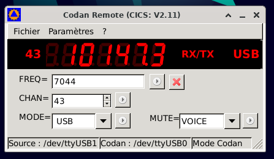
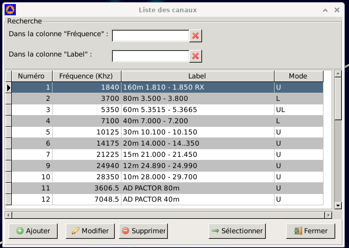
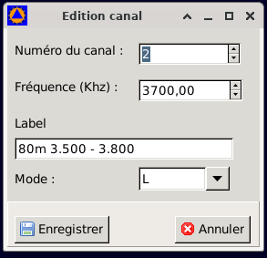

# CodanRemote

Utilitaire de pilotage des postes Codan 93xx et autres modèles utilisant le protocole CICS V 2 par le port série
Conversion des commandes CICS V3 vers CICS V2.1 envoyées par certains logiciels (Winlink express, Winlink tri-mode et Airmail)  
Conversion des commandes envoyées sur le port "remote" des modems pactor SCS et SWISS-PTCII lorsqu'ils utilisent le mode Codan.

  
Écran principal

---

  
Liste des canaux

---

   
Édition d'un canal

---

Exemple et contenu de fichier de liste
[export_ codan_ 080523.csv](docs/export_codan_080523.csv).

>"ID";"FREQ";"LABEL";"MODE"   
"1";"1840";"160m 1.810 - 1.850 RX";"U"  
"2";"3700";"80m 3.500 - 3.800";"L"   
"3";"5350";"60m 5.3515 - 5.3665";"UL"   
"4";"7100.0";"40m 7.000 - 7.200";"L"   
"5";"10125";"30m 10.100 - 10.150";"U"  
"6";"14175";"20m 14.000 - 14..350";"U"  
"7";"18118";"17m 18.068 - 18.168";"U"  
"8";"21225";"15m 21.000 - 21.450";"U"  
"9";"24940";"12m 24.890 - 24.990";"U"  
"10";"28.350";"10m 28.000 - 29.700";"U"

---

[Aide CICS V 3.2](docs/CICS_Help-1.pdf).
